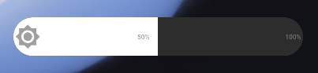
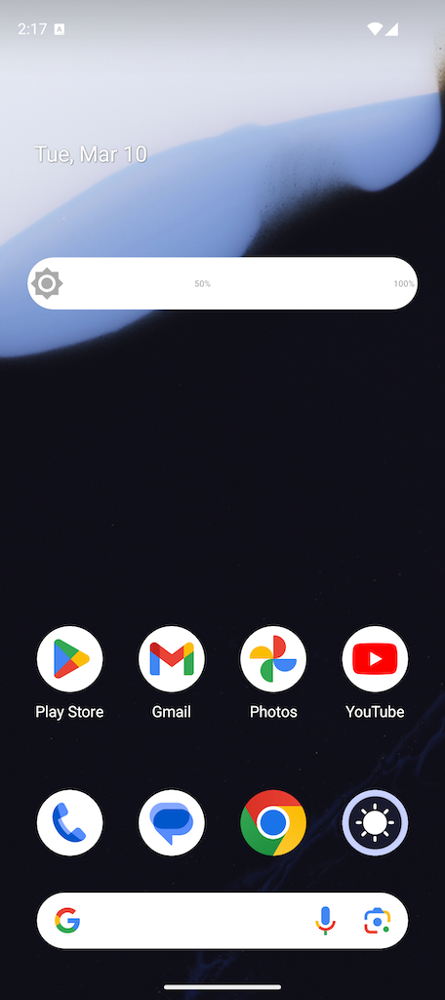

<p align="center">
  
</p>

<h1 align="center">Brightness Widget</h1>

<p align="center">
  A minimal Android home screen widget for controlling screen brightness with a single tap.<br>
  No bloat, no ads, no tracking — just a clean bar you tap to set brightness.
</p>

<p align="center">
  
</p>

---

## Screenshots

<p align="center">
  
</p>

---

## Features

- **Tap to set brightness** — 10-segment horizontal bar, tap any segment
- **Gamma-corrected** — steps match the Quick Settings slider positions
- **Auto-brightness disabled** automatically on tap so your setting sticks
- **Visual indicators** — subtle brightness icon, 50% and 100% labels
- **Resizable** — defaults to 4 columns wide, resize to any width
- **Lightweight** — no background services, no internet permission, no data collection

## Requirements

- Android 8.0 (API 26) or newer
- `Modify System Settings` permission (granted once through a simple setup screen)

## Installation

### Via Obtainium (recommended)

1. Install [Obtainium](https://github.com/ImranR98/Obtainium)
2. Tap **+** and enter: `https://github.com/crueber/android-brightness`
3. Obtainium finds the latest release APK and notifies you of future updates

### Direct APK download

Grab the latest signed APK from the [Releases](https://github.com/crueber/android-brightness/releases) page.

## Getting started

1. Open **Brightness Widget** from your launcher
2. Tap **Open Settings to Grant Permission** and enable the toggle
3. Long-press your home screen > **Widgets** > drag **Brightness Widget** onto your home screen
4. Tap any segment to set brightness — done!

## Building from source

### Prerequisites

- JDK 17 — `brew install --cask temurin@17`
- Android SDK — installed automatically by [Android Studio](https://developer.android.com/studio), or set `ANDROID_HOME` manually

### Build & install

```bash
# Build debug APK
JAVA_HOME=/Library/Java/JavaVirtualMachines/temurin-17.jdk/Contents/Home \
  ./gradlew assembleDebug

# Install to connected device
adb install -r app/build/outputs/apk/debug/app-debug.apk
```

### Useful commands

| Task | Command |
|------|---------|
| Debug APK | `./gradlew assembleDebug` |
| Release APK | `./gradlew assembleRelease` |
| Install to device | `./gradlew installDebug` |
| Lint | `./gradlew lint` |
| Clean | `./gradlew clean` |

### Customization

Edit `BrightnessConfig.kt` to adjust the number of segments:

```kotlin
const val BRIGHTNESS_STEPS = 10   // 10% increments (default)
const val BRIGHTNESS_STEPS = 20   // 5% increments, finer control
```

Remove and re-add the widget after changing.

## Publishing

- **GitHub Releases** — see [RELEASING.md](RELEASING.md)
- **F-Droid** — see [F-DROID.md](F-DROID.md)

## License

MIT — see [LICENSE](LICENSE)
